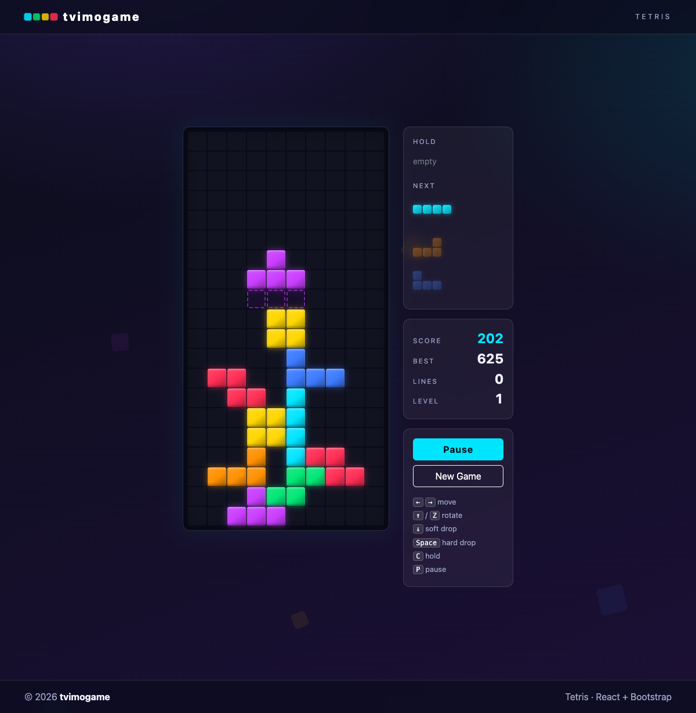
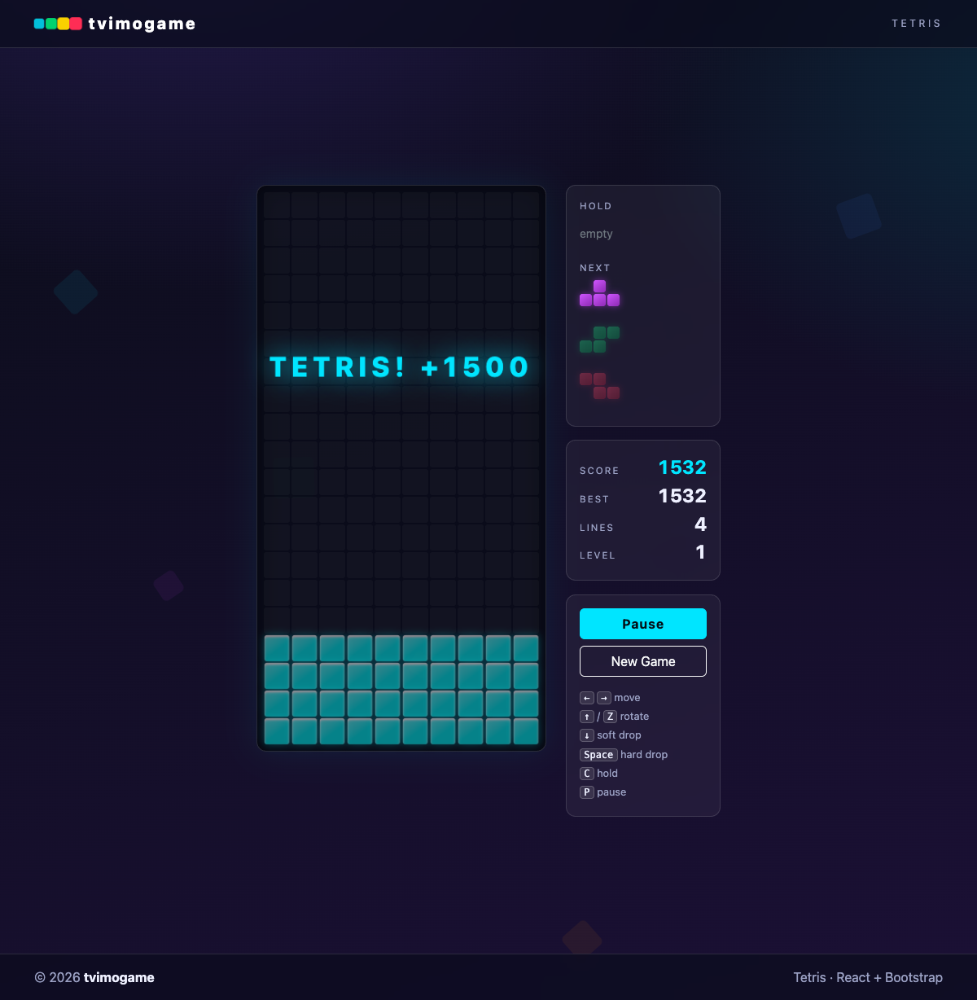

# Tetris — tvimogame

Классический Tetris на **React 19 + Vite + Bootstrap 5**. Тёмная неоновая тема,
анимации, ghost piece, hold, очередь следующих фигур и рекорд в localStorage.

**Играй прямо сейчас:** https://tvimogame.github.io/tetris/




## Запуск

```bash
npm install
npm run dev        # http://localhost:5173
```

Продакшен-сборка и предпросмотр:

```bash
npm run build
npm run preview    # http://localhost:4173
```

## Тесты

End-to-end тесты на Playwright (12 сценариев: управление, очки, hold,
пауза, проигрыш, ресарт, начисление очков за 1 и 4 линии):

```bash
npx playwright install chromium   # один раз
npm run test:e2e
```

Линтер: `npm run lint`.

## Управление

| Клавиша        | Действие              |
| -------------- | --------------------- |
| `←` / `→`     | движение              |
| `↑` / `Z`     | поворот (cw / ccw)    |
| `↓`           | мягкое падение (+1/клетка) |
| `Space`       | жёсткое падение (+2/клетка) |
| `C`           | hold (раз за фигуру)  |
| `P` / `Esc`   | пауза                 |
| `Enter`       | старт / рестарт       |

## Механики

- 10×20 поле, 7-bag рандомизатор, очередь из 3 следующих фигур
- Повороты с wall kick'ами
- Ghost piece — контур места приземления
- Hold с запретом повторного хольда до фиксации фигуры
- Очки за линии: **100 / 300 / 700 / 1500 × уровень** (4 линии = «TETRIS!»)
- Уровни: +1 каждые 10 линий, гравитация ускоряется
- Проигрыш, когда новая фигура не помещается при спавне
- Рекорд сохраняется в localStorage

## Структура

```
src/
  game/tetris.js        # чистая игровая логика (reducer, без React)
  hooks/useTetris.js    # игровой цикл, клавиатура, high score
  components/
    Board.jsx           # отрисовка поля (200 клеток)
    MiniPiece.jsx       # превью фигур (hold/next)
    GamePanel.jsx       # панель статистики и управления
    Tetris.jsx          # композиция + оверлеи (старт/пауза/проигрыш)
    Header.jsx          # шапка tvimogame
    Footer.jsx          # футер tvimogame
e2e/tetris.spec.js      # Playwright E2E
```
